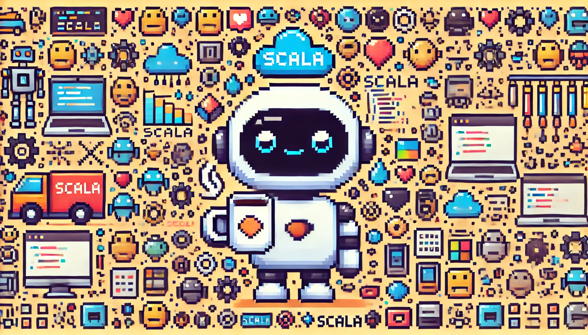
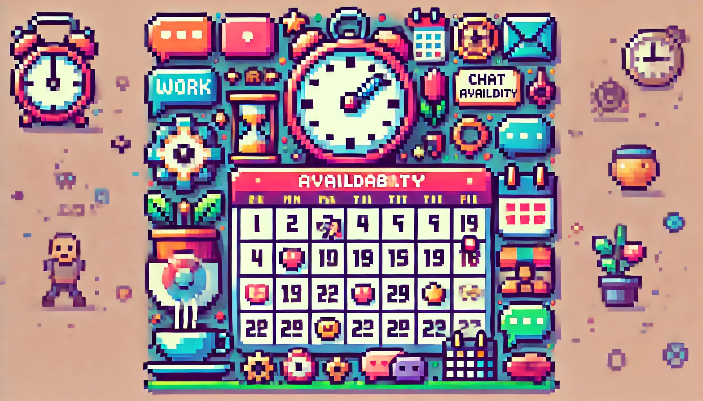
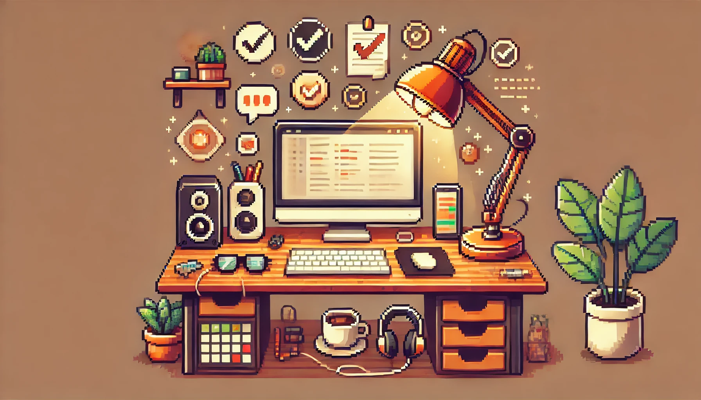
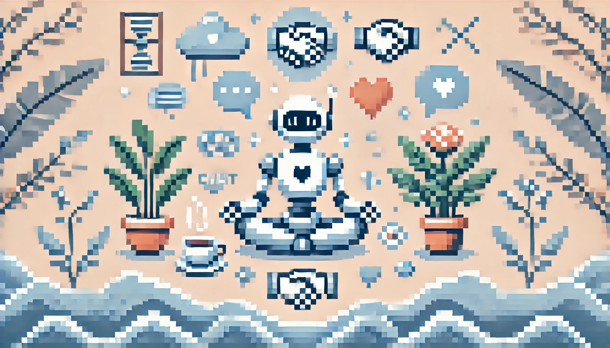
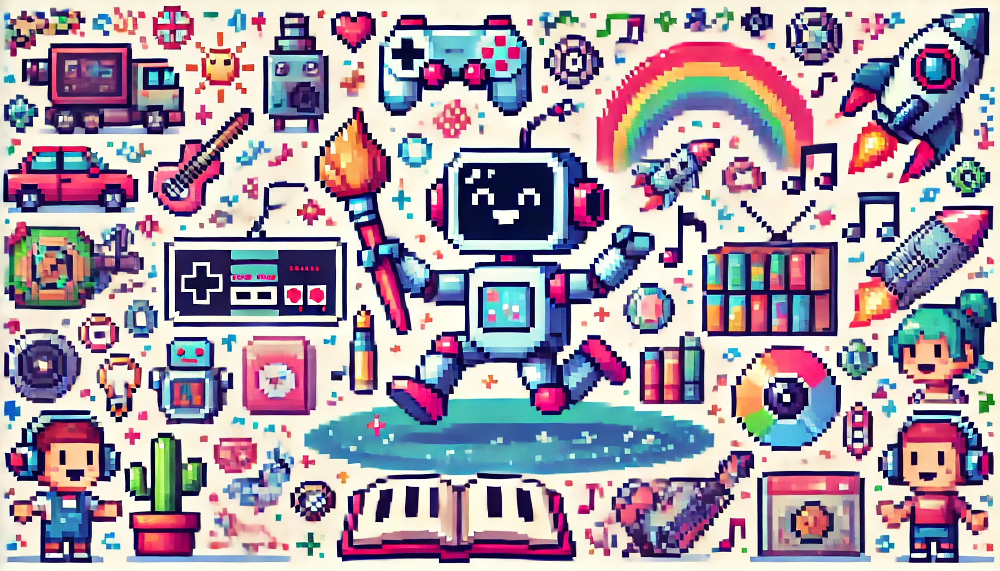
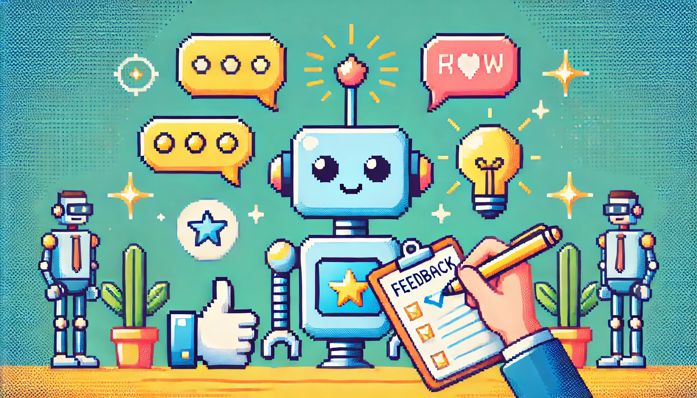
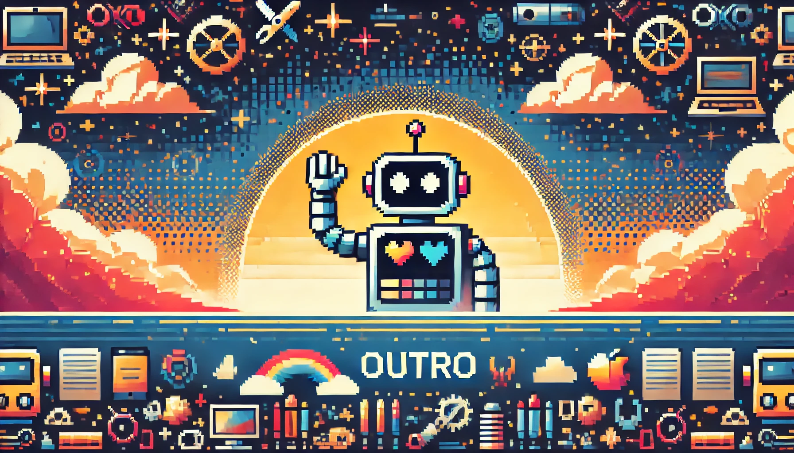

<h1>User Manual</h1>

    <h2>Introduction</h2>

    

    <ul>
        <li><strong>Name:</strong> Kyle Bowden</li>
        <li><strong>Role:</strong> Consultant - Software Engineering</li>
        <li><strong>Contact Information:</strong> <a href="mailto:kyle247365@gmail.com">kyle247365@gmail.com</a></li>
    </ul>

    <h2>Working Hours & Availability</h2>

    

<ul>
    <li><strong>Typical Working Hours:</strong> 9 AM - 5 PM (GMT) but my most productive hours are between 10 p.m and 1 p.m. </li>
    <li><strong>Best Times to Reach Me:</strong> Mornings are best; usually responsive to emails within 24 hours.</li>
    <li><strong>Preferred Communication Channels:</strong> Slack, Telegram, Signal, WhatsApp, and Email although I'm much slower to respond to emails.</li>
    <li><strong>Out-of-Office Protocol:</strong> I set up an auto-reply and may not be immediately available.</li>
    <li><strong>Holidays:<strong> I value my free time as it allows me to spend quality moments with family and friends, so I'm completely unreachable during those periods.</li>
</ul>

    <h2>How I Work Best</h2>

    

<ul>
    <li><strong>My Ideal Work Environment:</strong> For deep focus, I prefer being at home in my own office space and set up, as I find offices distracting for concentrated work. However, for collaborative tasks like brainstorming, I enjoy meeting up with my team in an office setting.</li>
    <li><strong>Best Way to Collaborate with Me:</strong> Clear agendas for meetings, along with a mix of engaging or spontaneous moments to keep things lively and avoid monotony.</li>
    <li><strong>Focus Hours:</strong> I prefer not to be interrupted, as it disrupts my ability to concentrate. I will put a slack status on to let you know ;)</li>
</ul>

    <h2>Communication Style</h2>

    

<ul>
    <li><strong>Response Time:</strong> I usually respond to messages within 30 minutes during work hours.</li>
    <li><strong>Preferred Communication Tone:</strong> Direct and to the point, but open to friendly chit-chat.</li>
    <li><strong>Feedback Preferences:</strong> I appreciate direct and constructive feedback; best given in private.</li>
    <li><strong>Meeting Style:</strong> Prefer scheduled meetings with a clear agenda.</li>
</ul>

    <h2>Strengths & Areas of Expertise</h2>

    

<ul>
    <li><strong>Key Strengths:</strong> Problem-solving, hands-on approach, and a strong drive to get things done efficiently.</li>
    <li><strong>Technical Skills:</strong> Scala, JavaScript, ReactJS, and a wide range of other programming languages/frameworks, as I consider myself a polyglot in coding.</li>
    <li><strong>Soft Skills:</strong> Communication, teamwork, adaptability</li>
    <li><strong>What I Can Help With:</strong> Developing infrastructure solutions, optimizing CI/CD pipelines, creating microservice APIs, building frontend services, and tackling any other challenges you throw my way.</li>
</ul>

    <h2>Things I Need From My Team</h2>

    

<ul>
    <li><strong>Support:</strong> Clear requirements, access to necessary tools and resources</li>
    <li><strong>Communication:</strong> Honest and timely feedback, open communication</li>
    <li><strong>Collaboration:</strong> I see pairing as a valuable tool; it may not be needed for every task, but it’s highly effective in many cases. I also enjoy connecting with team members through occasional virtual hangouts or in-person meetups when possible.</li>
</ul>

    <h2>How I Handle Stress & Conflict</h2>

    

<ul>
    <li><strong>How I Manage Stress:</strong> I take short breaks, listen to music, go for a walk</li>
    <li><strong>Approach to Conflict Resolution:</strong> Prefer open and honest discussions; I value finding common ground</li>
</ul>

    <h2>Personal Interests & Fun Facts</h2>

    

<ul>
    <li><strong>Hobbies & Interests:</strong> Game development, drawing, sculpting, trying out new tech.</li>
    <li><strong>Fun Fact:</strong> I’m currently working on developing my own indie game!</li>
    <li><strong>Preferred Break Activity:</strong> Taking a quick walk, watching a tech or current events video on YouTube, or catching up on the latest tech news.</li>
</ul>

    <h2>Things That Energize Me</h2>

    

<ul>
    <li><strong>Motivators:</strong> Learning new things, solving complex problems, building something from scratch.</li>
    <li><strong>Inspirations:</strong> Seeing the positive impact of my work, and successful collaboration.</li>
</ul>

    <h2>How to Provide Feedback to Me</h2>

    

<ul>
    <li><strong>Best Way to Give Feedback:</strong> Direct, specific, and with clear examples</li>
    <li><strong>Feedback I Appreciate:</strong> Feedback that helps me improve my skills or approach</li>
    <li><strong>Feedback I Don’t Respond Well To:</strong> Vague criticism without actionable points</li>
</ul>

    <h2>The End</h2>

    

<!--
**kyle-bowden/kyle-bowden** is a ✨ _special_ ✨ repository because its `README.md` (this file) appears on your GitHub profile.

Here are some ideas to get you started:

- 🔭 I’m currently working on ...
- 🌱 I’m currently learning ...
- 👯 I’m looking to collaborate on ...
- 🤔 I’m looking for help with ...
- 💬 Ask me about ...
- 📫 How to reach me: ...
- 😄 Pronouns: ...
- ⚡ Fun fact: ...
-->
